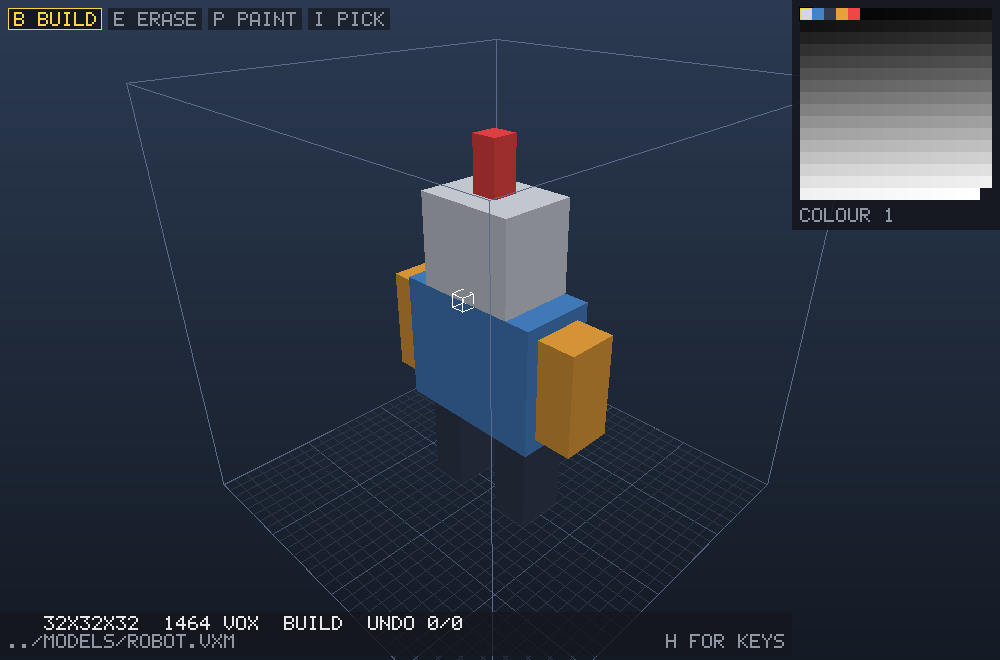

# rs-voxeler

A voxel model editor and software renderer in Rust, a rewrite of the ideas in
the Python `voxeler`.

It is a tool for **making models** — by hand at the window, or by an agent over
MCP — and the renderer under it exists to show you what you are making. It is
not a game engine and is not becoming one.

```bash
cd crates && cargo build --release
./crates/target/release/voxeler models/robot.vxm
```



## What exists

| crate | what it is |
| --- | --- |
| `voxel-core` | the model: a stack of dense grids, a 256-colour palette, undo/redo, `.vxm` and MagicaVoxel `.vox` |
| `voxel-render` | a software rasterizer: face extraction, orbit camera, z-buffer, flat shading, PNG output |
| `voxeler` | the editor: a window, four tools across four reaches, layers, a palette you can click, and an MCP server |

## Documentation

- [`docs/ARCHITECTURE.md`](docs/ARCHITECTURE.md) — how it is put together, and
  why each load-bearing decision is the shape it is, with the measurements that
  settled the ones measurement settled.
- [`docs/DEVELOPMENT.md`](docs/DEVELOPMENT.md) — building, testing, measuring,
  and the mistakes this codebase has already made once.

## Using the editor

```bash
voxeler [FILE] [--size N] [--mcp [PORT]]
voxeler mcp [DIR...]              serve an agent over stdio, headless
voxeler attach [DIR]              open a window onto a running `voxeler mcp`
voxeler FILE --thumbnail out.png [--width N] [--height N]
```

`FILE` defaults to `model.vxm` and does not have to exist — a missing file
starts a **32³** volume with one voxel at its centre to build against.
`--size 64` gives you the larger volume; a file that already exists keeps
whatever size it was saved at, so `--size` only ever describes a new model. A
`.vox` extension reads and writes MagicaVoxel's format; anything else is the
editor's own `.vxm`.

The volume is centred on the origin, spanning ±size/2 on every axis, and the
grid runs through the middle of it. That grid is the work plane, and it is where
a layer *starts*: while the active layer is empty you can click the plane
directly, from either side, so a new layer — or one you have just erased the last
voxel of — is never a dead end. Once that layer holds something, the plane
closes and you build against what you made, so empty space stops being clickable
and a click meant for the camera cannot place a voxel. Press `A` for a new layer
to start another part somewhere else. The other tools act on a voxel, and do
nothing over empty space.

| | |
| --- | --- |
| left click / drag | apply the current tool |
| right drag, alt+left drag | orbit |
| middle drag, shift+drag | pan |
| wheel | zoom |
| `B` `E` `P` `I` | build, erase, paint, pick colour |
| `1` `2` `3` `4` | reach: voxel, axis, plane, volume |
| `9` `0` `C` | brush smaller, bigger, cube/ball |
| `shift+F` `shift+S` | flatten, smooth |
| `[` `]` / `-` `=` | colour ∓1 / ∓16 |
| `X` `Y` `Z` | mirror the edit across each axis (`M` = `X`) |
| `L` `shift+L` | next / previous layer |
| `A` `D` | add / delete a layer |
| `T` | trim the layer's box to its contents |
| `V` `N` | show-hide / rename the active layer |
| `K` `J` `U` | move the layer up / down, merge it down |
| `G` | ground grid |
| `,` `.` `\` | slice down, slice up, slice off |
| `F` `R` | frame the model, reset the view |
| `ctrl+Z` `ctrl+Y` | undo, redo |
| `ctrl+S` `ctrl+E` | save, export `.vox` |
| `ctrl+D` | subdivide the scene ×2 |
| `ctrl+R` `ctrl+N` `ctrl+Q` | reload, clear, quit |
| `H` | the same list, in the window |

## Two choices, not eleven tools

What a click does and how far it reaches are separate settings, so every tool
is available at every reach rather than as its own entry in a long list:

| | `1` voxel | `2` axis | `3` plane | `4` volume |
| --- | --- | --- | --- | --- |
| `B` build | place a voxel, or stamp a brush | extrude to the wall | fill across the face | flood the cavity |
| `E` erase | remove one, or a brush of them | drill through | strip the face | delete the part |
| `P` paint | recolour one | recolour the run | recolour the face | recolour the part |

A **region** — plane or volume — grows over cells holding the same palette index
as the one under the cursor. Building starts on air, so it floods air; erasing
and painting start on a voxel, so they stop where the colour changes. On a
one-colour model that is "everything connected"; on a model with a red panel on
a blue body it is the panel. Nothing reaches past a slice.

The **brush** is how far an edit reaches: `9` and `0` size it, `C` switches
between a cube and a ball, and the outline in the viewport shows its extent.
Radius 0 is the single voxel everything else is measured from.

That radius is also what decides whether an edit is a **click or a drag**. A
region with no limit happens once — dragging an unlimited flood would re-seed it
several times a frame and leave a wandering pile of fills. Give the same flood a
radius and it covers a patch the size you asked for, and you can drag it:

```
3 PLANE  + radius 0   fill the whole face, one click
3 PLANE  + radius 3   raise a patch of it, dragged like a brush
4 VOLUME + radius 0   the whole connected part
4 VOLUME + radius 3   as much of it as is within three cells
```

So resizing the brush no longer snaps you back to the voxel span — under a
flood, the radius is the thing that makes the flood workable by hand.

## Sculpting

Two of the tools do not paint a colour onto a reach — they decide, cell by cell,
what the surface should be:

```
SHIFT+F      FLATTEN   level to the plane the stroke started on
SHIFT+S      SMOOTH    round corners off, close notches
```

`FLATTEN` locks a plane at mouse-down from the cell and face you hit, and never
re-estimates it: material in front of that plane goes, and air behind it fills
**only where something is holding it up**. A dent fills to the plane; the space
under a table stays empty. The lock is the point — re-deriving the direction
every frame makes the brush flap as it crosses a corner and the stroke fights
your hand.

`SMOOTH` is a vote over each cell's six face neighbours. A solid cell with two
or fewer solid neighbours is a spur and goes; an air cell with four or more is a
notch and fills. **One press is one pass** — every decision is read before any
is applied, so a smooth cannot cascade into itself and eat the surface; press
again to go further.

Two-or-fewer is a rule about *thin* material: it takes off spurs, closes pits
and rounds the corners of a one-cell sheet, but leaves the corner of a solid
block alone — that corner still has three solid neighbours. Reach for `FLATTEN`
to cut a block back.

Fills take the commonest colour of the cell's solid neighbours, so closing a
notch in a red panel gives you red rather than whatever the brush was set to.

Both take the brush ball rather than the span, because they need to see the
material behind a cell as well as the air in front. `9` and `0` size it.

An agent gets the same operations through one call:

```json
{"at": [16, 24, 16], "mode": "smooth", "radius": 5}
{"at": [16, 9, 16], "mode": "flatten", "radius": 6, "normal": "-y"}
```

`raise` and `lower` are there too. `normal` matters only to `flatten` and
defaults to the first open face at that cell.

## Layers

A layer is a grid of its own, and the stack composites top down: what you see at
a cell is the topmost visible layer holding something there. So an armour layer
sits *over* the body it covers rather than consuming it — hide the armour and
the body is still underneath, whole.

```text
  ARMOUR   · █ █ ·        hide ARMOUR →   █ █ █ █
  BODY     █ █ █ █                        (the body, intact)
```

### Each layer has its own box

A scene's size is the **range** voxels may occupy, not a grid that gets
allocated. Each layer carries an origin and a size of its own and costs only
that, so a ground plane, a tree and a character can share a 64³ scene without
three copies of it:

```text
  GROUND     origin  0, 0, 0    size 64 x  5 x 64
  TREE       origin 20, 5,10    size 16 x 32 x 16
  CHARACTER  origin 40, 5,40    size 16 x 16 x 16
                                     ─────────────
  allocated                          32 769 cells
  four 64³ grids would be         1 048 576 cells
```

The box **grows to fit** whatever you draw, so a new layer starts empty and
costs nothing until used, and you never have to size one before drawing in it.
Declaring a box up front is a statement of where a part will live, not a wall:

```
add_layer  name=TREE  origin=[20,5,10]  size=[16,32,16]
```

It shrinks only when asked — `T` in the editor, `trim_layer` over MCP — so
erasing and redrawing in one spot does not churn the allocation. The active
layer's box is outlined in the viewport, since where it sits is otherwise the
one thing you cannot see.

`.vxm` is now **VXM3** and stores each layer's box. `VXM2` and `VXM1` still
load, and are trimmed on the way in: an old file gains the smaller shape simply
by being opened.

The panel under the palette lists the stack, top first, with each layer's own
voxel count. Click a row to select it, click its box to show or hide it.

Interactive tools write to the **active layer** and only to it. That is what makes layers
worth having, and it has one consequence worth knowing: clicking a voxel some
other layer owns does nothing, and the status line says which layer holds it.
Building is the mirror image — a voxel a *higher* layer is showing never blocks
a build underneath it, because working under something is what a lower layer is
for. A fill selects on what you can see and writes what you own.

`ctrl+Z` undoes layers being added, deleted, moved and merged, along with the
edits made on them. Showing and hiding is not undoable — it is a thing you do
constantly, and undo would spend its first few presses turning layers back on —
but it *is* saved, because which layers you had hidden is part of the model.

`.vxm` stores every layer's own grid, its name, whether it was shown, and which
one you were editing, so hiding a layer and saving never throws it away. `.vox`
has nowhere to put a stack, so `ctrl+E` writes the composite as one model and
says so.

**Mirroring** is per axis: `X`, `Y` and `Z` each toggle a plane through the
middle of that axis, and the `MIRROR X Y Z` row under the tools shows which are
on. Two active planes give four copies of every stroke and three give eight. It
reflects the *edit*, not the model — nothing is written that the stroke did not
touch.
Turning mirroring on does not go back and symmetrise what is already there, so
a model that is deliberately lopsided stays lopsided while you work on it
symmetrically.

`ctrl` is `cmd` on macOS; both work everywhere.

## Driving it from an agent

The repository includes three reusable skills:
[`skills/voxeler-modeling`](skills/voxeler-modeling/SKILL.md) for building a
model from scratch — reference-based modeling, layered batch edits and verified
previews — and [`skills/voxeler-editing`](skills/voxeler-editing/SKILL.md) for
changing one that already exists. [`skills/voxeler-checking`](skills/voxeler-checking/SKILL.md)
covers read-only model QA. Ask your agent to read the one that fits the
task, or install the relevant directories in your agent's skill directory for
discovery.

Two transports, because they answer different questions.

**`voxeler mcp` — stdio, headless.** The agent starts it, so "is the server
running?" never comes up. Name the directories its `open`/`save` tools may
reach; they are the only part of the filesystem it can see:

```json
{ "mcpServers": { "voxeler": { "command": "voxeler",
                               "args": ["mcp", "/path/to/models", "/path/to/voxels"] } } }
```

Replace those paths with existing absolute directories. JSON arguments are passed
directly to the process: `~` and environment variables are not shell-expanded.

**Name them.** A desktop MCP client spawns its servers with whatever working
directory the *app* happened to have, so without an argument neither you nor the
agent can say where a bare file name lands. (If that working directory turns out
to be the filesystem root, the server refuses to start rather than quietly
handing an agent every file on the machine.)

The directories are reported back in the server's `initialize` instructions, so
the agent is told where it may write before it tries. Paths given to the tools
may be **absolute inside any of them**, or relative to the first.

**`voxeler attach` — a window onto that session.** The stdio server is headless,
so this is how a person joins and watches the model being built:

```bash
voxeler attach                # the session rooted here, or the only one running
voxeler attach ~/models       # a particular one
```

It is a viewer, not a second editor: the camera is yours — orbit, pan, zoom, `F`
to frame, `,` `.` `\` to slice, `G` for the grid — and the keyboard is the
agent's. There is one document and one undo history, and they live in the
server. If nothing is running, it says so and how to start one.

**`voxeler FILE --mcp [PORT]` — SSE, from a window you already have open.** For
when you were editing first and want an agent to join *you*:

```json
{ "mcpServers": { "voxeler": { "type": "sse", "url": "http://127.0.0.1:8730/sse" } } }
```

Both listeners bind loopback only — they hand control of your document to
whoever connects.

| tool | what it does |
| --- | --- |
| `describe_model` | size, voxel count, bounds, the layer stack, active layer, colour |
| `put_voxel` | one voxel; colour 0 erases |
| `put_rect` | a solid axis-aligned box, corners inclusive |
| `apply_edits` | ordered voxel/box/ellipsoid/line/tapered-line/prism edits across layers, one undo step |
| `put_ellipsoid`, `put_line` | ellipsoid or rounded thick line, optionally on a named layer |
| `put_tapered_line` | a cone, tapered branch or flat-ended cylinder along any direction |
| `put_prism` | extrude a simple polygon into armour, with inclusive boundaries |
| `check_symmetry`, `check_components` | scoped, read-only mirror and connectivity findings |
| `preview_model`, `screenshot_views` | focused preview and labelled multi-view sheet |
| `compare_saved_model` | compare native saved content without reopening |
| `paint` | recolour the voxels in a box, creating none |
| `fill` | flood fill from a cell, over the active layer's connected shape |
| `set_color`, `find_color` | select a palette index; find the one nearest an RGB |
| `set_palette_color` | change an index's RGB across all layers, with undo/redo |
| `count_by_color` | which colours the model is made of, and how much of each |
| `select_by_color` | hold every voxel of one colour, ready for a transform |
| `replace_color`, `merge_colors`, `swap_colors` | move voxels between palette slots |
| `compact_palette` | drop unused entries, renumber, and rewrite the voxels to match |
| `add_layer`, `select_layer`, `set_layer_visible`, `trim_layer` | the layer stack and its boxes |
| `list_objects`, `create_object`, `rename_object`, `delete_object` | the scene tree: what each part *is* |
| `set_layer_object`, `reparent_object`, `set_object_visible` | put layers in parts, parts in parts, and hide either |
| `move_object` | move a part and everything under it, one undo step |
| `rotate_object` | turn a part and everything under it a quarter turn at a time |
| `create_instance`, `place_instance`, `detach_instance` | repeat a part by reference; edit the source and every copy follows |
| `screenshot` | clean PNG preview, camera presets, lighting, optional file output |
| `undo`, `redo` | take back whole tool calls |
| `subdivide` | scale the scene up so every voxel becomes `factor`³ of them |
| `select_box`, `select_connected`, `select_layer_all` | hold voxels for a transform |
| `sculpt_surface` | flatten, smooth, raise or lower a surface at a point |
| `describe_selection`, `clear_selection` | what is held, and let go |
| `move_selection` | move the held voxels, one undo step |
| `rotate_selection`, `flip_selection` | turn or mirror them about their own box |
| `copy_selection`, `cut_selection`, `paste` | the clipboard |
| `duplicate_selection` | copy and paste at an offset, in one step |
| `new_model`, `open_model`, `save_model`, `list_models` | files inside the root; listing includes subdirectories |

`screenshot` is the one that shows rather than counts — a voxel total cannot
tell you the arm is on backwards. It takes `yaw` and `pitch` in degrees and
frames the model's contents, so it fills the picture whatever the volume's size,
and it puts the camera back where it found it.

One tool call is **one undo step**, so `undo` takes back a whole fill however
many voxels it moved. The history is shared with whoever has the window.

## Colour as a way of naming a part

"All the red" is a part in a way "all the cells in this box" is not.
`count_by_color` says what a model is actually made of; `select_by_color` turns
one colour into a selection the transforms already understand.

`replace_color`, `merge_colors` and `swap_colors` move voxels **between palette
slots**; `set_palette_color` changes what a slot means. `swap_colors` swaps the
voxels rather than the entries, which puts the same picture on screen either way
but leaves index 3 meaning the red it meant — so a brush set to 3 still paints
red.

`compact_palette` drops unused entries, renumbers what is left from 1 upwards and
rewrites every voxel to follow, as one undo step for both halves. It renumbers,
so it returns the mapping and moves the selected colour along with it.

Index 0 is air, not a colour, and all of these refuse it: "replace 0 with white"
would mean every empty cell.

## Objects: naming the parts

A layer says how pixels combine; an **object** says what a thing is. Objects
nest, layers belong to one, and every scene has a root holding anything you have
not filed elsewhere.

```text
SCENE
 ├── ROBOT              hide this and the whole robot goes
 │    ├── BODY          layers: BASE, PAINT
 │    └── LEFT ARM      layers: SKIN
 └── SWORD              layers: BLADE
```

Hiding an object hides every layer inside it without touching their own
switches, so showing it again restores exactly what was shown before.

The panel on the right draws the tree, so the parts are visible at the window
and not only in the file:

```
  SCENE
    LAYER 1                0
  - ROBOT
      BODY              1512
    - ARM L                     <- hollow switch: this part is hidden
        UPPER            216    <- hollow with a pip: switched on, hidden by ARM L
    - ARM R
        MIRRORED         216    <- filled with a notch: an instance's copy
```

On an object row the switch hides that part and anywhere else folds it shut.
On a layer row the switch toggles the layer and anywhere else selects it.

`move_object` moves a part and everything under it by whole voxels. Nothing is
re-created — each layer's box slides — so moving a finished robot costs the same
as moving an empty one. It is all or nothing: if any part of the subtree would
leave the scene, nothing moves and the message says which layer and which axis.

`rotate_object` turns one a quarter turn at a time. That one cannot be free —
there is no stored transform, so the voxels are rewritten — but the rules are
the ones the selection transforms already use: counter-clockwise about the
positive axis by the right-hand rule, and pivoting about the low corner rather
than the centre, so a turn and its inverse come back exactly. The whole subtree
turns about **one** pivot, the low corner of everything it holds, so the parts
keep their spacing:

```
BODY  4x16x3 at [10,10,10]        BODY  16x4x3 at [10,10,10]
ARM   7x2x3  at [14,20,10]   ->   ARM   2x7x3  at [14,14,10]
```

A non-square footprint therefore lands somewhere new; follow with `move_object`
if you wanted it in place. An instance cannot be turned — rotate its source, and
every copy turns with it.

The tree is saved in the file, so the next session still knows what the parts
are. That is what makes an agent's edits semantic: "make the left arm longer" is
an object, not a coordinate hunt.

### Instances: draw it once, use it four times

Voxel models are mostly repetition — wheels, windows, teeth, towers, and above
all mirrored pairs. `create_instance` repeats an object as a **reference**
rather than a copy, so editing the source changes every copy at once:

```
create_instance  source="ARM L"  name="ARM R"  dx=14  mirror=["x"]
```

`dx`/`dy`/`dz` place it *relative to the source*, so the copy keeps its offset
when the source grows. `mirror` reflects about the middle of the source's own
box, which is what puts a mirrored arm beside the body rather than across the
scene.

An instance gets one layer, on top of the stack, holding what the source
composites to. Writes to it are refused, naming the source:

```
"ARM R" repeats "ARM" — edit "ARM" to change every copy, or detach it to
make this one its own work
```

That is a rule rather than an obstacle: you edit the source, and all four
wheels follow. When you want one copy to differ, `detach_instance` turns it
into ordinary work — it keeps exactly the voxels it is showing, so nothing on
screen changes, and its layer starts taking writes.

`place_instance` moves or re-mirrors one. Placing is all or nothing: a
placement that would put any part outside the scene is refused and nothing
moves. Editing the *source* is different — a copy that no longer fits gets
clipped rather than refusing an unrelated edit, and `list_objects` marks it
`clipped` so it is not lost quietly.

The file stores the reference, not the cells: an 87-voxel arm costs eight bytes
as an instance against 348 as a copy, and reopening rebuilds it from whatever
the source says *now*.

## Selecting and moving

Drawing puts voxels down; a selection picks them back up. `S` is the select
tool, and `O` switches what it picks:

```
S            SELECT TOOL
O            SELECT CELLS / OBJECTS
W ESC        SELECT WHOLE LAYER / CLEAR
ARROWS       MOVE   (SHIFT = Z AXIS)
SHIFT+X Y Z  TURN 90 DEG ABOUT AXIS
ALT+X Y Z    FLIP  (CELLS ONLY)
CTRL+C X V   COPY / CUT / PASTE
```

**In cells mode** the span row means what it always means — one voxel, a run, a
face, the connected part — and the selection is matched on material, so an arm
is one part whether or not the glove on the end is a different colour.

**In objects mode** a click picks the whole part under the cursor, across every
layer it is built from, and the arrows and turns go through `move_object` and
`rotate_object`. That is the difference that matters: a part built from two
layers moves as one thing, where a cell selection would take only the layer you
were on and tear it in half.

Both outline in the viewport, in different colours, because you can have one of
each. **Clicking empty space clears both** — pointing at nothing and pressing is
how you say "never mind", and it drops the object and the cells together,
because "nothing selected" is one idea. `ESC` does the same from the keyboard.

Alt-drag still orbits and shift-drag still pans while the select tool is
active: looking at the thing you are about to select is part of selecting it.

There is no duplicate key: paste puts the clipboard back where it was copied
from, so copy, paste, arrows is the same operation with the offset chosen by
eye.

```
select_connected  x=8 y=12 z=11  from=[7,0,0] to=[9,23,23]
move_selection    dx=-2 dy=0 dz=0
```

A selection is the set of **cells**, not a box — air inside a box is not
selected, so moving carries the shape rather than a cube of nothing that erases
whatever it lands on. It belongs to the layer it was made on, so changing the
active layer afterwards still moves the voxels you were shown.

`select_connected` grows by **material, not colour**, so a part made of several
colours comes out whole. But a limb is attached to its body, so unbounded
connectivity can only ever answer "the whole figure" — give `from`/`to` and the
growth is held inside that box, which is what makes "this arm" sayable. The
growth is bounded, not trimmed afterwards: a flood that spread *through* cells
outside the box would come back with parts the box was meant to keep out.

`rotate_selection` turns a quarter at a time, counter-clockwise about the
positive axis by the right-hand rule — the same sense face winding uses.
It pivots about the **low corner** of the selection's box rather than its
centre, because centring is not invertible: a quarter turn swaps two extents,
and where those differ in parity the centre falls between cells, so the rounding
accumulates and turning a thing back leaves it a cell out. A square footprint
pivots identically either way. `flip_selection` mirrors within the box, which
needs no centre and is exact at any size.

Every transform is one undo step. Each clears the source and writes the
destination in one batch, clears first, so a transform whose result overlaps its
own source — a short move, a rotation of a squat shape — does not eat its own
arrival. Voxels pushed outside the scene are lost and
counted. The selection follows the voxels, so a move can be repeated or refined.

`duplicate_selection` then `flip_selection` is the whole of a mirrored pair,
with no coordinate arithmetic in between: the copy lands selected, so the flip
knows what to act on. A paste writes to the **active layer** rather than the one
the voxels came from, which is how a part gets copied onto a layer of its own,
and the clipboard holds cells relative to the copied selection's low corner, so
pasting at that corner puts back exactly what was copied.

Undo drops the selection — it names coordinates, and an undo changes what is at
them. The **clipboard survives undo**: undo puts the model back, not the
clipboard, so a paste you undid can be pasted again. The current selection is outlined in the viewport, so whoever is attached
can see what an agent is about to move.

## Subdividing

`subdivide` is how a coarse model becomes a detailed one: get the silhouette
right at 16³, then scale up and carve into the room you have made. It applies to
**every layer at once** and is one undo step — the scene's own size included, so
`ctrl+Z` really does put the coarse model back. It is a plain replication rather
than a smoothing: corners stay square, so what you carve is carved against what
you drew. `ctrl+D` in the editor does the same by 2.

The file tools accept absolute paths inside any allowed directory, or paths
relative to the first directory. They refuse paths outside those directories,
`..` components and symlinks. Under `--mcp`, where you opened the document
yourself, file access is unavailable.

Returned `path` fields from `list_models`, `save_model` and `screenshot` follow
the same rule: relative to the first directory, absolute otherwise. They can be
passed back to file tools without changing which file they name. `list_models`
also returns an `absolute` field for each file; prefer it when selecting assets
across multiple directories. `describe_model.path` is only a display basename.

Coordinates are model space — `0..size` on each axis, +Y up, the same
coordinates the file stores.

**Every edit reports what it did**, because an agent cannot see the screen and
"ok" tells it nothing:

```json
{"targeted": 32, "added": 16, "removed": 0, "repainted": 1, "unchanged": 15,
 "layer": "ARMOUR", "layer_voxels": 16, "model_voxels": 32}
```

The four outcomes are exclusive and sum to `targeted`, which is what makes them
a measurement rather than a reassurance: ask for a 5×5×5 box and read
`targeted: 125, added: 0` and you know you aimed at solid rock.

The agent and you share one editor, one undo history and one file. A whole tool
call is **one** undo step, so a box an agent filled costs you one `ctrl+Z`.
Basic MCP tools write to the active layer and only to it — `fill` refuses a cell another
layer owns rather than copying that layer's shape onto this one, and says which
layer to select instead. Batch and curved modeling tools also accept an explicit
layer; palette RGB edits affect every use of that index across the model.

Not exposed: deleting or merging layers and changing the user's camera.
Screenshot settings affect the returned image only; the editor's view is restored.

### Batch and curved modeling

`apply_edits` takes an `edits` array. Each operation has `op` set to `voxel`,
`rect`, `ellipsoid`, `line`, `tapered_line` or `prism`. Top-level `layer` and `color` set defaults;
individual operations may override them. An omitted layer uses the active
layer, but explicit layer arguments never change the selection.

```json
{
  "layer": "BODY",
  "color": 1,
  "edits": [
    {"op": "ellipsoid", "center": [63.5, 40, 64], "radii": [20, 27, 16]},
    {"op": "line", "from": [45, 50, 64], "to": [33, 32, 64], "radius": 4},
    {"op": "rect", "from": [50, 5, 55], "to": [59, 12, 70]},
    {"op": "voxel", "x": 63, "y": 40, "z": 80, "color": 65}
  ]
}
```

Every operation is validated before any voxel is written. Later writes win on
overlaps, and the entire call is one undo step, even across layers. Reports count
write attempts: a cell touched twice contributes twice to `targeted`. A request
can contain up to 262,144 operations and 2,097,152 candidate cells; shape bounding
boxes count toward that budget before filtering. Split larger requests into
separate calls (the SSE transport also has an 8 MiB message limit).

`put_ellipsoid` uses the same `center`, `radii`, `color` and `layer` arguments.
`put_line` uses `from`, `to` and `radius`; rounded ends make it a capsule, or a
sphere when the endpoints coincide. Integer coordinates denote voxel centers;
fractional centers such as `63.5` allow exact symmetry in an even-sized scene.
Radii must be greater than zero and at most 256. Centers/endpoints must be inside
`0..=size-1`; curved surfaces are clipped at the scene boundary. Boxes and single
voxels reject out-of-range coordinates. Colour 0 erases the addressed layer.

`put_tapered_line` adds independent `radius_from` and `radius_to` to `from` and
`to`. Radii interpolate linearly along the axis; flat end faces are perpendicular
to that axis, so a slanted branch's tip follows the branch rather than world-up.
A zero endpoint radius makes a point, and equal radii make a flat-ended cylinder
(not the rounded capsule that `put_line` draws). Both radii must be in 0..=256,
at least one must be positive, and the endpoints must be distinct. Integer
coordinates sample voxel centers, so a very thin or fractional tip can miss a
cell; inspect the rendered result at the working resolution.

For a branch that stays thick until near its tip, join two segments with matching
radii at the joint. Both can be one undo step, with an erase before them to
replace an existing branch:

```json
{"layer":"CHONMAGE","color":1,"edits":[
  {"op":"tapered_line","from":[90,116,64],"to":[96,119,64],"radius_from":3.5,"radius_to":3},
  {"op":"tapered_line","from":[96,119,64],"to":[103,122.5,64],"radius_from":3,"radius_to":0}
]}
```

These are drawing operations, not a resize of selected geometry. They accept an
explicit layer, leave selection unchanged, and share the batch validation,
candidate-cell budget, clipping, colour-0 erase and undo rules above.

`set_palette_color` accepts `{"index":65,"r":200,"g":25,"b":36}`. It changes
every voxel using index 65, including those in hidden layers, and is undoable.
It does not select that colour; use `set_color` for selection. RGB changes are
preserved in both `.vxm` and `.vox` files.

### Preview and file discovery

`screenshot` hides scene/layer bounds by default and uses softer lighting than
the editor. `show_bounds: true` includes those editing guides. `ambient` and
`diffuse` each range from 0 to 1 (defaults 0.7 and 0.3).

```json
{"view":"front","width":768,"height":768,"ambient":0.8,"diffuse":0.2,"path":"models/front.png"}
```

`view` accepts `front`, `back`, `left`, `right`, `top` and `three_quarter`.
Front views from +Z toward -Z; right views from +X. Explicit `yaw` or `pitch`
overrides that angle of the preset. Without a preset or explicit angles, the
editor camera's angles are used. Neither successful nor failed PNG output changes
the user's camera, grid setting, undo history or model save state.

An optional `path` writes the same PNG returned in the image block. Its parent
directory must exist, its extension must be `.png`, and it must be inside an
allowed directory. PNG file output is unavailable in the windowed SSE server, just like
model file output; returning an image still works. `--thumbnail` also frames the
model's contents, hides bounds and uses the softer preview lighting.

`list_models` searches all allowed directories recursively by default and sorts
paths. For one directory only, use `{"directory":"models","recursive":false}`.
Directory names may be absolute inside an allowed directory, or relative to the
first. File tools reject symlink paths, and recursive listing skips symlink files
and directories.

### Model inspection and polygonal armour

`check_symmetry` compares mirrored occupied cells and optionally palette indices.
`axis` is required; `plane` defaults to the scene midpoint and accepts integer
or half-integer coordinates. It reports mismatched pairs and bounded samples.
`check_components` reports connected components by size, bounds and owning
layers; `connectivity:6` requires face contact, while 26 includes corners.
Neither tool treats its findings as automatic defects.

Both accept one of `layer`, `object` (with descendants), or `selection:true`.
The default scope is the visible composite; `include_hidden:true` composites
hidden layers too. Optional inclusive `from`/`to` clips the inspected region.
The limit is 2,097,152 inspected source voxels; narrow the scope if refused.
`limit` (1..1000, default 100) bounds samples/components, not the total count.

`preview_model` frames that same scope, isolated by default. `isolate:false`
keeps visible surroundings (cannot combine with `include_hidden:true`).
`screenshot_views` returns a labelled sheet with shared framing and lighting:

```json
{"object":"HEAD","views":["front","right","back","left","top","three_quarter"],"width":256,"height":256}
```

Dimensions are per tile (64..512 for sheets, 64..1024 for single previews).
These perspective previews ignore the working slice and preserve all live
editor state. Optional PNG `path` uses the existing file-access restrictions.

`compare_saved_model` compares with the working `.vxm`, or an explicit `path`,
without reopening. It includes hidden layers, hierarchy, palette and active
layer; allocation slack and editor-only state are ignored. `.vox` is refused.
`describe_model` now exposes `document_path`, process `session_id` and
`document_id` (changes on document replacement, not ordinary edits or saves).
After reconnection, establish identity before replaying any edits.

`put_prism` extrudes a simple polygon; batch `apply_edits` also accepts
`op:"prism"`. Vertices are [y,z] for axis X, [x,z] for Y and [x,y] for Z.
`start`/`end` are inclusive, and voxel centres on edges are included. Vertices
may be fractional; either winding and concavity work. Crossing edges, holes,
repeated vertices and out-of-scene coordinates are refused. Example:

```json
{"axis":"z","vertices":[[40,60],[87,60],[76,48],[51,48]],"start":80,"end":84,"color":1}
```

The existing batch candidate budget and all-or-nothing, one-undo semantics apply.

## Roadmap

The three crates are in place — `voxel-core` (model, palette, `.vox` interop),
`voxel-render` (visible faces, camera, z-buffer, flat light) and `voxeler` (the
editor and its agent surface). What comes next is judged by whether it makes
*modelling* better:

- **Getting models out.** `.vox` caps at 256³ and cannot express the layer
  stack. Interchange for printing and for other tools is [#36](https://github.com/fpt/rs-voxeler/issues/36).
- **Greedy meshing**, which is the lever on rendering cost at large scenes.
- **Cheaper undo for bulk edits** — [#40](https://github.com/fpt/rs-voxeler/issues/40).
- **Sparse storage**, if an unbounded canvas is ever wanted — [#18](https://github.com/fpt/rs-voxeler/issues/18),
  where it is measured and deliberately gated.

Deliberately *not* on that list: an entity system, a scripting bridge, physics,
a game. Those were once the plan and are not any more.

## Licence

MIT OR Apache-2.0.
